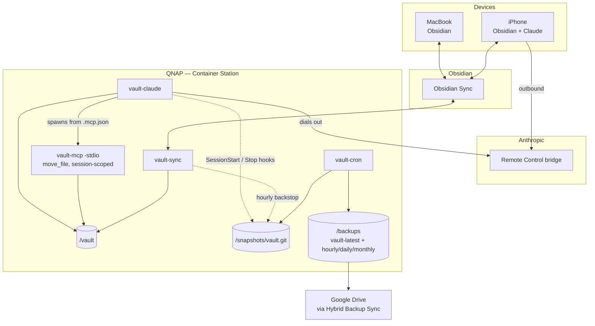
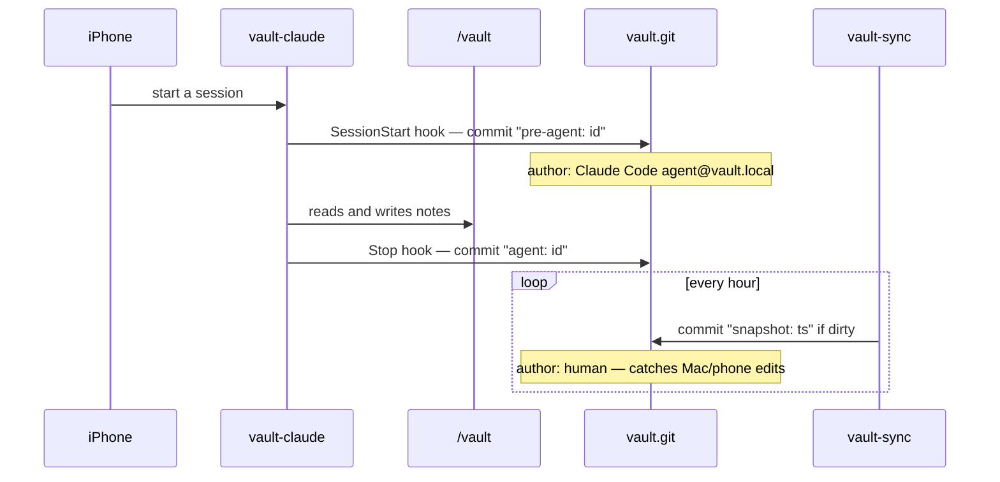
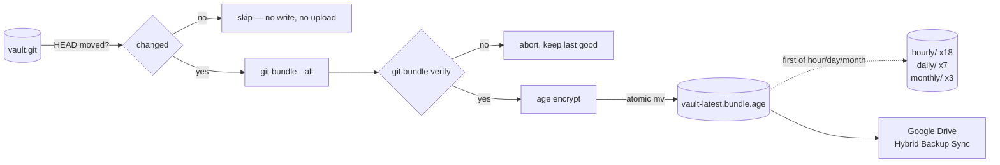
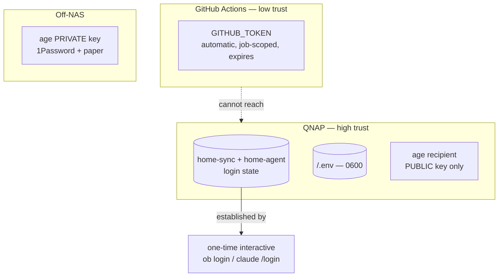

# Architecture

What this system is and how the parts fit together.

- **Operating it** — [`README.md`](README.md)
- **Why it is this way** — [`DECISIONS.md`](DECISIONS.md)

> Headings here are stable anchors. Code comments link to them by name
> (`ARCHITECTURE.md#invariants`), not by section number — the previous document
> numbered its sections and the numbering drifted out of sync within a week.

---

## What it does

An always-on Claude Code session rooted in an Obsidian vault, running on a QNAP
NAS, drivable from an iPhone — with git version history and verified,
encrypted, off-site backups.

**No inbound connections anywhere.** The agent and the phone both dial *out* to
Anthropic's Remote Control bridge, which pairs them. That is why the UniFi
gateway needs no configuration: no port forwarding, no public endpoint, no
tunnel, and nothing to expose if the ISP uses CGNAT.



---

## Services

One image, four roles. Sync and the agent are separated because their
**lifecycles differ** — the agent gets restarted for version bumps and wedged
sessions, and that must not interrupt sync.

| Service | Command | Lifecycle | Mounts |
|---|---|---|---|
| `vault-sync` | `ob sync --continuous` + hourly snapshot backstop | always on | vault, snapshots, `home-sync` |
| `vault-claude` | `claude remote-control` in tmux | always on, restarted often | vault, snapshots, `home-agent` |
| `vault-cron` | supercronic → `backup.sh` on `BACKUP_SCHEDULE` | always on | snapshots, backups |
| `backup` | one `backup.sh` run | `profile: manual`, ad-hoc | snapshots, backups |

**Hostnames are pinned** (`nas-vault-sync` etc.). `ob` reports the hostname to
Obsidian Sync as the device name and Docker defaults it to the container ID, so
without pinning every recreate registers a new phantom device.

**`vault-cron` runs `backup.sh` directly**, over the same volumes. It does not
`docker run` a sibling container, which would require mounting
`/var/run/docker.sock` — effective root on the NAS for no benefit. *For no
benefit* is the load-bearing half: the [`dashboard`](../dashboard/) stack mounts
that socket deliberately, because deploying from a browser needs it, and
[`DECISIONS.md`](DECISIONS.md#the-dashboard-and-the-docker-socket) records what
that costs. A cron job is still the case where it buys nothing.

**tmux wraps the agent** because `claude remote-control` is a TTY application
that prints a pairing QR, not a daemon. tmux allows detach, reattach over
`docker exec`, and restarting the agent without recreating the container.

**A fifth process runs inside `vault-claude`, and nothing here starts it.**
Claude Code spawns `vault-mcp -stdio` from `<vault>/.mcp.json` as a local MCP
server and it lives and dies with the session. It exists because Claude Code has
no move tool and `Bash` is denied, so without it the agent cannot file or rename
a note at all. It is the same binary and the same Go source `vault-mcp` serves
to voice from, built into this image — which is why a change under `vault-mcp/`
rebuilds this one. See [DECISIONS.md](DECISIONS.md#giving-the-agent-a-move).

---

## Volumes

```
/share/CE_CACHEDEV4_DATA/obsidian/     encrypted volume (CE_ prefix), auto-unlock
├── vault/        the Obsidian vault      1002:100
├── snapshots/    vault.git + state       1002:100
├── backups/      bundles                 1002:100   <- the only one HBS touches
├── home-sync/    Obsidian credentials    1002:100  0700
└── home-agent/   Claude OAuth token      1002:100  0700
```

**The credential volumes are split on purpose.** `vault-sync` mounts only
`home-sync`, `vault-claude` mounts only `home-agent`, and the backup path mounts
neither. The agent reads a corpus it did not entirely author, so a prompt
injection can make it read its own filesystem; splitting means one compromise
yields one credential rather than both.

**Identity is `1002:100`** — a real QNAP account (`kylejs`), not the
conventional-looking 1000. See [DECISIONS.md](DECISIONS.md#identity-1002-not-1000).

`APP_UID`/`APP_GID` are **build args**, so changing them means rebuilding the
image, not editing `.env`. Docker resolves `$HOME` from `/etc/passwd`; a uid the
image does not know gets `$HOME=/`, and both interactive logins then appear to
succeed and silently fail to persist.

---

## Snapshots

The repository lives **outside** the vault: `GIT_DIR=/snapshots/vault.git`,
`GIT_WORK_TREE=/vault`. No `.git` or `.gitignore` ever appears inside the vault,
so Obsidian's indexer and the sync client never see them and nothing git-shaped
propagates to the phone. Exclusions live in `$GIT_DIR/info/exclude`, rewritten
on every run so config changes take effect without recreating the repo.



Commits **bracket agent runs via hooks, not a timer** — a timer can fire mid-run
and capture a half-finished state. The hourly loop is only a backstop for human
edits, which hooks never observe. `flock` serialises the two.

Agent writes are attributed to `Claude Code <agent@vault.local>`, which makes the
repo an audit log:

```sh
git --git-dir=/snapshots/vault.git log --author="Claude Code" --since=1.week --stat
```

Given the agent writes unattended, that audit trail is arguably worth more than
the undo capability.

**The same attribution is also written into the note.** A `PostToolUse` hook
(`scripts/hook-stamp.sh`) stamps `agent-created`, `agent-modified` and `agent`
into the frontmatter of every note the agent writes. That is duplication on
purpose: this repository lives outside the vault, so it is invisible from
Obsidian on the phone, and a note that leaves the vault through Sync carries
none of its history. The repo answers *what changed*; the stamp answers *who
last wrote this note* from inside the note. `vault-mcp` writes the same three
properties as `claude-voice`, which makes it a shared contract rather than a
feature of this stack — see the root [`README.md`](../README.md#shared-contract)
and [`DECISIONS.md`](DECISIONS.md#agent-stamps-in-frontmatter).

**`.claude/settings.json` is committed** — it is inside the vault and not
excluded — so the agent's tool policy restores along with the notes.

It is also **installed from the image on every agent start**, by
`install-settings.sh`, from the copy of `vault-claude-settings.json` baked in
beside the hook scripts it references. The file in the repo is the source of
truth and the one in the vault is a materialisation of it, which is why the two
cannot be deployed out of step: the hooks and the file that wires them up travel
in the same image. Both properties hold at once — it is a real file in the
vault, so it is committed and restored, and it is regenerated on start, so it
cannot silently lag the repo. See
[`DECISIONS.md`](DECISIONS.md#shipping-the-tool-policy-with-the-image).

---

## Backups



**One bundle, replaced in place.** A bundle contains the *complete history*, so
a single current file already provides every point in time:

```sh
age -d -i key.txt vault-latest.bundle.age > v.bundle
git clone v.bundle restored
git -C restored checkout 'HEAD@{2026-08-01}'
```

**The stamped copies are corruption insurance, not history.** A corrupted,
ransomwared or history-rewritten repo gets faithfully bundled straight over the
top of the good copy. Retention is sized by *how long until you would notice*,
not by how far back you want to read.

The tiers are that noticing window at three granularities. `hourly/` bounds how
much *work* a bad bundle can cost: without it, the newest copy predating the
damage is the day's first bundle, so a bad afternoon costs the whole day.

It is sized to a waking day — 18 changed hours — so damage introduced and
noticed within the same day is recoverable to the hour. Past a day there is
nothing further to buy, since a single bundle already holds every point in time;
`daily/` takes over there. At ~112 MB a copy that is ~2 GB, the deliberate cost
of the window. See DECISIONS.md#backups-bundles-and-why-only-one.

**Runs where `HEAD` has not moved are skipped**, so an idle vault costs no
storage and no upload. Frequency therefore controls staleness, not cost.

**Backups are bundles, not a file-sync of the live repo.** A live repo is files
under mutation — packfiles, refs, `index.lock` — and a sync client will
eventually capture a torn state, producing a clone that fails `fsck` silently.

Two state files under `/snapshots`:

| File | Meaning |
|---|---|
| `.snapshot.lock` | `flock` target serialising hook and backstop commits |
| `.last-bundled-sha` | last successfully bundled `HEAD`; **mtime = when the job last ran**, touched even on skipped runs |

Those are two different questions — *did the job run* vs *did the vault change* —
and `preflight.sh` checks them separately. Conflating them makes an idle week
look identical to `vault-cron` being dead.

---

## Trust boundary



The credentials that matter are **login state, not deploy-time configuration**.
They are established once by an interactive login *inside the container* and
persist in the volumes. They never enter GitHub Actions, which keeps CI's entire
secret inventory to `GITHUB_TOKEN`. A full compromise of the workflow gets an
attacker the ability to push a bad image tag and nothing else.

`age` is asymmetric so the NAS holds only the **encrypting** half. A NAS
compromise cannot decrypt existing backups; a passphrase scheme would have to
store the secret on the box and would hand over everything.

**Volume encryption defends drives that leave the building** — theft, RMA,
resale, disposal — and nothing at all against a running NAS. It is no help
against a QTS compromise, and no substitute for `AGE_RECIPIENT`, because Hybrid
Backup Sync reads the decrypted file and would upload plaintext.

`vault-claude` refuses to start when no tool policy is present, so "the agent
ran without one" is a crash-looping container rather than a silent condition.

The agent's tool policy lives in `<vault>/.claude/settings.json` and denies
`Bash`, `WebFetch`, `WebSearch`, reads/writes of the credential and snapshot
paths, `<vault>/.mcp.json` at any depth, and writes to `AGENTS.md`/`CLAUDE.md` at
any depth. Those denied tools are precisely the ones that turn a prompt injection
into a breach.

**`.mcp.json` is denied for a stronger reason than the rest.** An entry added
there is an arbitrary command Claude Code executes at the start of every future
session — the `AGENTS.md` case, "persistent compromise, not a one-shot", with
the shell the agent does not otherwise have. It is denied at any depth, and the
deny list `vault-mcp` mirrors already refuses every dotted path, so the move tool
cannot be used to shuffle one into place either.

**The move tool does not widen this boundary.** It is not a shell: one tool that
relocates one file, enforcing the same deny list in Go — including on the
*source*, so a note cannot be moved out of the way to make `CLAUDE.md` stop being
`CLAUDE.md`. It opens no socket, makes no network call, and has no credential
mounted. Prompt injection's third leg, egress, is exactly as absent as it was.

It moves attachments as well as notes, and that does not change the paragraph
above: the file *types* it may touch are wider than the rest of the server's,
the *paths* are identical. A move also creates nothing — it relocates bytes
already in the vault — so there is no new content for an injected instruction to
author, only a file it could put somewhere unhelpful, which the snapshot repo
undoes.

**That policy binds `vault-claude` and nothing else.** Claude Code reads it;
`vault-mcp` does not, and the claude.ai client on the far end of `vault-mcp`
cannot be given one at all — it has web access this repo has no way to revoke.
So the two surfaces are protected differently on purpose: `vault-claude` reads
the whole vault with no way to send anything out, and `vault-mcp` keeps the
folders unvetted material lands in out of a conversation that does have one. See
[`../vault-mcp/README.md`](../vault-mcp/README.md#what-voice-cannot-see).

---

## Invariants

**Every rule here fails silently when broken.** That is what makes them worth
listing separately from the reasoning.

| Invariant | What breaks if violated |
|---|---|
| Hybrid Backup Sync points at `backups/` **only** | `snapshots/` is a live repo and will sync torn; the credential volumes hold a live OAuth token and your Obsidian login |
| Never create a QNAP **shared folder** for `snapshots`, `home-sync` or `home-agent` | `0700` is irrelevant once a directory is exported over SMB |
| Never relocate agent state (`.claude.json`) into the synced vault | This is the only reason we are immune to the upstream OneDrive corruption cascade |
| Never run a second Claude Code instance against `home-agent` | Concurrent instances corrupt `~/.claude.json`; `docker compose stop vault-claude` before re-authenticating |
| Never add `.claude` to `info/exclude` | The tool policy silently stops being backed up while every check still passes |
| Do not enable Obsidian config sync expecting it to carry `.claude/` | It will not, and expecting it to would widen who can edit the agent's own permissions |
| Keep `APP_UID` a **real, allocated** account | QNAP hands unallocated uids to the next account created, which would inherit the credential directories |
| All five paths stay on the same `CE_` volume | One on a plain volume silently leaves the encrypted set |
| `AGE_RECIPIENT` set ⇒ every published bundle is `.age` | A backup that reverted to plaintext looks identical to a working one |
| If skills move into the vault, keep them **write-denied** to the agent | Skills are instructions; an injected note authoring one is a persistent compromise |
| Every surface that writes into the vault stamps, under the **same** property names | Half the agent writes stop answering a query written against the other half, and the notes they touched read as human-authored |
| `hook-stamp.sh` mirrors the deny list rather than relying on `settings.json` | Hooks run outside the permission system, so the stamping hook becomes a writer that can reach `CLAUDE.md` |
| A stamped note is the note the agent wrote plus the stamp lines, and nothing else | A misread frontmatter block puts properties into prose, silently, one note at a time |
| Edit `vault-claude-settings.json` in the repo, never the vault's copy | The next agent start reinstalls it from the image and the edit is gone — with no error, and no sign it was ever applied |
| The same applies to `vault-claude-mcp.json` and `<vault>/.mcp.json` | Identical failure, and the symptom is worse: the agent silently has no move tool and reports notes filed that were not |
| `<vault>/.mcp.json` stays write-denied to the agent, at any depth | An entry added there is a command every future session executes — the `AGENTS.md` compromise, with a shell |
| Never add a second tool to the `-stdio` surface without deciding about the stamp | MCP tool calls fire no `PostToolUse` hook, so a second write tool reaches the vault unstamped while looking like any other edit |
| Moving stays the only thing any surface does to a non-markdown file | A read or a create for attachments turns a note server into a general file server, and the markdown-only rule stops meaning anything |
| An attachment move is unstamped **by necessity** — do not assume the frontmatter covers every agent write | A dataview query over `agent-modified` silently misses every image the agent ever filed; with `EXCLUDE_ATTACHMENTS=1` the audit log is the only record there is |

`scripts/preflight.sh` asserts most of these and repairs the mechanical ones with
`--fix`. Run it after any QNAP change.

---

## Known unresolved risk

`ob sync --continuous` and Claude Code's file tools write to the same directory
concurrently, and Claude's writes are not guaranteed atomic. Partial writes can
propagate to other devices via Sync.

This is **not theoretical**. Claude Code has open issues about `~/.claude.json`
being corrupted by concurrent instances — no file locking, non-atomic writes
([#28847](https://github.com/anthropics/claude-code/issues/28847),
[#29217](https://github.com/anthropics/claude-code/issues/29217)). The
cautionary case is [#29153](https://github.com/anthropics/claude-code/issues/29153):
a home directory on OneDrive, so a sync client and Claude Code writing one tree.
It cascaded into 165 corrupted files in 40 minutes and a login loop, each
recovery attempt corrupted by the competing process.

We are immune to *that* cascade by construction — the credential volumes are
outside the synced vault — but the vault-side race remains. Snapshots make it
**recoverable, not prevented**. If it bites, escalate in order:

1. A temp-then-rename write wrapper. *Unreliable — agents do not consistently use
   a prescribed script.*
2. Serialise: pause sync while an agent session is active, via a lock file the
   sync loop respects.
3. Switch the agent to an MCP server with atomic writes, or take the Obsidian
   plugin route, where writes go through Obsidian's own vault API and the race
   disappears — both at the cost of Claude Code semantics.
