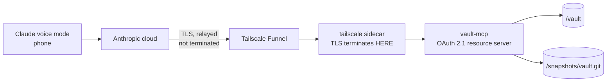

# vault-mcp

The Obsidian vault as a remote MCP server, so Claude's **voice mode** can search
it, read from it and capture into it hands-free.

The same binary is also `vault-claude`'s move tool — the one thing Claude Code
cannot do for itself — run locally over stdio with `-stdio` and serving exactly
one tool. See [Two surfaces, one
binary](#two-surfaces-one-binary).

- **The agent stack** — [`../obsidian-vault/`](../obsidian-vault/)

> This is the only stack in the repo reachable from the internet. Read
> [Trust boundary](#trust-boundary) before deploying it.

---

## Why this exists

`vault-claude` is the surface for real work: a full Claude Code session with
grep, file tools, `CLAUDE.md` and skills, driven from the phone over Remote
Control. It has one gap — **the phone app's voice mode cannot drive it**.

Voice mode *can* call custom connectors, verified 2026-08-09 against the authless
DeepWiki server: voice discovered the connector, called it, and read the result
back. `obsidian-vault/DECISIONS.md` lists "Remote MCP server + Claude app" as a
rejected fallback, and that assessment still holds **as a replacement** — it
loses grep, file tools and skills. As a *second surface* it costs none of that,
because `vault-claude` is untouched and keeps all of it.

The trade it does make is real and is the subject of the rest of this file:
connector traffic is routed from Anthropic's cloud, not from the phone, so this
component needs a publicly reachable endpoint. Nothing else here does.

---

## Why Funnel and not Cloudflare

This was built on Cloudflare Tunnel first and moved to Tailscale Funnel on
2026-08-10, for one reason: **Cloudflare terminates TLS at its edge, so it can
read note contents in plaintext.** That is inherent to any TLS-terminating
reverse proxy or CDN, not a Cloudflare quirk — the proxy has to see the request
to route it. Anthropic's own [MCP tunnels](#mcp-tunnels-the-design-to-migrate-to)
run over Cloudflare and add a second, inner TLS layer terminated by a
certificate only the operator holds, specifically so that "Cloudflare cannot
read request or response payloads". We cannot do the same, because the inner
layer needs cooperation from the client and the client here is Claude's ordinary
connector fetcher.

Tailscale Funnel does not have the problem. It proxies the encrypted TCP stream
and **TLS terminates on this node**; Tailscale relays bytes it cannot read.

| | Cloudflare Tunnel | Tailscale Funnel |
|---|---|---|
| Who can reach it | Anthropic's IPs only, via a WAF rule | anyone who has the URL |
| Who can read your notes | **Cloudflare, at its edge** | nobody but the NAS |
| New dependency | a domain + a Cloudflare account | none — Tailscale already runs here |
| Access control | WAF rule **and** the token | the token alone |

The cost is real and worth stating plainly: Funnel does not forward the caller's
public IP ([tailscale#12972](https://github.com/tailscale/tailscale/issues/12972)),
so there is no edge allowlist and **the access token is the whole of access
control**. The judgement is that adding a party who can read personal notes is
worse than losing a second gate in front of a credential that expires. That is a
judgement, not a fact, and it is the thing to revisit if it ever feels wrong.

Switching back is a compose-service swap: set `MCP_ALLOWED_CIDRS` and
`MCP_CLIENT_IP_HEADER`, and point cloudflared at `vault-mcp:8080`. The server
supports both paths.

---

## Designing tools for voice

Voice is not text chat with a microphone attached, and the tools are shaped for
it deliberately.

| Constraint | Consequence |
|---|---|
| Results are **spoken** | Reads are capped at 8 KB, search returns a title plus one line. A tool that returns 4 KB of markdown produces a voice response nobody sits through. |
| A clarifying question costs a **whole turn** | `capture_note` takes one parameter. Notes resolve by title, so "Reading list" and "Reading list.md" are the same note — spoken input never includes the extension. |
| The model **cannot see** what it wrote | Every write returns the path it touched, so Claude can say "captured to Inbox" rather than guessing it worked. |
| Errors get **read aloud** | Expected failures return actionable tool output ("that text appears more than once, include surrounding lines"), not protocol errors the model can only apologise for. |

This came out of watching the DeepWiki test: its tools are built for text chat,
and over voice the interaction needed a disambiguation round trip before it
could do anything.

---

## Tools

| Tool | Does | Notes |
|---|---|---|
| `search_notes` | keyword search over titles and bodies | title matches first; plain substring scan, no index to keep in sync |
| `read_note` | read one note | truncates at 8 KB and says so |
| `list_notes` | list a folder | dotted entries hidden |
| `capture_note` | append a timestamped line to `CAPTURE_NOTE` | the main voice path — one parameter, no path to disambiguate |
| `append_note` | add to the end of any note | creates it if absent; never touches existing content |
| `create_note` | new note with a body | fails if it exists; refuses to overwrite |
| `edit_note` | replace anchored text | anchor must appear exactly once |
| `move_file` | move or rename a note **or an attachment** | refuses to overwrite, cannot change an extension, creates missing folders; the only tool served over `-stdio` |

**There is no delete tool, and no tool takes whole-file replacement content.**

That distinction is the whole design. An `edit_note` that accepted full content
would be a delete with extra steps, so edits are anchored: `old_text` must match
exactly once, or the call fails. `edit_note` additionally refuses any edit whose
result would be blank — without that, passing a short note's entire body as the
anchor with an empty replacement empties it, and "no delete" would have been
decorative. `vault_test.go` asserts both properties.

`move_file` is the one tool that touches two paths, and it does not weaken any
of that. It is a `rename(2)`, not a copy-and-delete: a copy would double the
file on disk for as long as the delete took to land, and `ob sync` would
propagate the duplicate and then the deletion to every device — the shape of a
sync conflict rather than a move. It refuses an occupied destination *before*
writing anything, so a rejected move is a complete no-op, and the deny list is
applied to **both** ends. That last part matters more than it looks: denying
only the destination would leave "move `CLAUDE.md` to `Archive/old`" as a way to
revoke the vault's standing instructions without ever writing to the file.

---

## Attachments

`move_file` is also the **only** operation here that may touch a file that is
not a note. Everything else — read, search, list, create, append, edit — stays
markdown-only and refuses a `.png` exactly as it always did.

That exception is narrow because a move *creates* nothing. It relocates bytes a
human already put in the vault, so none of the reasoning that keeps this server
markdown-only ("a `notes.txt` reference must not become `notes.txt.md`", "an
edit that takes whole-file content is a delete with extra steps") has anything
to bite on. There is no new content, no new file and no new path class.

| Rule | Why |
|---|---|
| An **allow list** of extensions, not "anything not denied" | A vault holds notes and the things they embed. A `.sh`, a `.js` or a `.json` in one is not an attachment, and relocating executable- or configuration-shaped files is capability with no use case behind it. The set is `attachmentExts` in `vault.go`: images, PDFs, EPUB, audio, video, `.canvas` and `.base`. The last two are documents Obsidian renders and the user authors — a Bases view is a saved query over the vault's own notes, so it needs filing and renaming alongside the notes it indexes — not configuration, which is what the `.sh`/`.js`/`.json` line is about. |
| **The extension may not change** | A move relocates; it never converts. This stops `scan.png` → `scan.md` (a binary Obsidian would try to render as a note), refuses `.jpeg` → `.jpg` because it converts nothing, and — the reason it is a hard rule rather than a nicety — it is what keeps the note and attachment code paths from being selectable independently at each end, which is where a stamp-a-binary bug would live. |
| **Every path denial applies unchanged** | Widening the file *types* must never widen the reachable *paths*. `.claude/`, `.mcp.json`, any dotted folder, `AGENTS.md` and `CLAUDE.md` are refused for attachments exactly as for notes, in both directions of the move. |
| **No read, no stamp** | A PNG has nowhere to put YAML frontmatter, and a `.canvas` or `.base` is parsed whole by Obsidian, so a stamp would break it rather than annotate it. Either way the move is a bare `rename(2)` — the file is never opened. That is also why a 200 MB video move is one syscall and never enters this process's memory. |

**The stamp gap is real and is not papered over.** The shared contract promises
that every agent write is attributed *in the file itself*; nothing on this list
can carry that, so a moved image, canvas or Bases view is recorded only by the
snapshot commit and the `move_file` line in the audit log. If the vault runs
`EXCLUDE_ATTACHMENTS=1`, the media are outside git and the audit log is the
**only** trace — `snapshot.sh` excludes binary types, so a `.canvas` or `.base`
is still committed. A sidecar `.md` per attachment was considered and rejected:
it doubles the file count in the vault to describe files Obsidian already shows
you, and Sync would carry the sidecar and the image as two unrelated objects
that can arrive apart.

**What this does not do: update links.** Obsidian rewrites `![[scan.png]]` in
every note when you move an attachment in the app. This does not — it moves one
file and touches nothing else. With Obsidian's default *shortest path when
possible* link format an embed keeps resolving after a move, because it matches
on filename; a **rename** breaks it either way, and so does a move in a vault
configured for relative or absolute paths. Renaming through this tool is
therefore the case to be careful with. Rewriting backlinks would mean editing
notes the caller never asked to change, which is a much larger decision than
this tool.

---

## Two surfaces, one binary

`vault-claude` — the Claude Code session on the phone — could not move a note.
Claude Code has no move tool, `Bash` is denied to it (see
[`../obsidian-vault/vault-claude-settings.json`](../obsidian-vault/vault-claude-settings.json)),
and writing a copy at the new path leaves the original behind with nothing in
the vault allowed to delete it. Triage that ends in *"file this under
Projects/"* was unexpressible.

So this binary runs a second time, inside the agent container, as a local MCP
server:

```jsonc
// <vault>/.mcp.json, installed from obsidian-vault/vault-claude-mcp.json
{ "mcpServers": { "vault-tools": {
    "command": "/usr/local/bin/vault-mcp",
    "args": ["-stdio"],
    "env": { "VAULT_DIR": "/vault", "MCP_SNAPSHOT": "0", "MCP_EXCLUDE": "" } } } }
```

One binary rather than a small mover written in Node, because the deny list in
`vault.go` is a **mirror of the agent's own tool policy** and a second
implementation is a second thing to keep in step — the drift the shared contract
in the root README exists to prevent. The agent image builds this Go source
itself (`obsidian-vault/Dockerfile`), which is why that image's build context is
the repository root and why a change to `*.go` here rebuilds it too.

Since 2026-08-31 it runs a **third** time, in `vault-research`, pointed at the
scratch volume instead of the vault and with one extra tool:

```jsonc
// <scratch>/.mcp.json, installed from obsidian-vault/vault-research-mcp.json
{ "mcpServers": { "vault-tools": {
    "command": "/usr/local/bin/vault-mcp",
    "args": ["-stdio"],
    "env": { "VAULT_DIR": "/scratch", "MCP_SNAPSHOT": "0",
             "MCP_EXCLUDE": "", "MCP_FETCH": "1" } } } }
```

`VAULT_DIR=/scratch` is doing more than it looks. Every containment rule in
`vault.go` — the traversal checks, the symlink resolution, the dotted-path
denies — applies to whatever root it is given, so pointing it at the scratch
volume gets all of them for a directory that is not the vault, with no second
code path.

What each surface changes, and why:

| | HTTP (voice) | `-stdio` (vault) | `-stdio` (research) |
|---|---|---|---|
| Root | `/vault` | `/vault` | `/scratch` |
| Tools | all seven | `move_file`, `import_attachment` | `move_file`, `fetch_attachment` |
| Auth | OAuth 2.1, subject allow list | none — there is no listener; the client is the process that spawned it | none, same reason |
| `MCP_EXCLUDE` | applied | ignored | ignored |
| Snapshot commits | this server commits each write | `MCP_SNAPSHOT=0`; the session's `Stop` hook commits | `MCP_SNAPSHOT=0`; scratch is not a repo |
| Stamp identity | `claude-voice` | `VAULT_AGENT_NAME`, default `claude-agent` | not stamped; nothing here is a vault note yet |
| Audit subject | the WorkOS user id | `vault-claude` | `vault-research` |

**`import_attachment` is the other half of the same handoff.** `fetch_attachment`
gets a file onto the NAS; nothing could then get it into the vault, because
`move_file` is rooted at `VAULT_DIR` and `resolveRef` refuses every spelling of a
path outside it. So the one file type the fetch tool exists to produce was the
one type the research handoff could not carry. `import_attachment` copies one
attachment from `IMPORT_DIR` into the vault: separate source `Vault` so the
containment checks apply at that end too, both ends through `writablePath`,
attachments only, extension unchanged, never overwriting, and a copy rather than
a rename so the scratch sweeper stays the only thing that deletes there. It adds
no egress — `vault-claude` still cannot reach the network.

**The two never share a surface.** `loadConfig` refuses `MCP_FETCH=1` together
with `IMPORT_DIR`: together they are "reach the open web, then write into the
vault" in one session. Until that check existed only configuration kept them
apart, and the test asserting the split failed the first time it ran.

**`fetch_attachment` exists because no permission can substitute for it.**
WebFetch fetches a page, converts it to Markdown and runs a prompt against it
with a small model, so it returns text and never a file. `Write` emits text, so
it cannot author the bytes even when handed them, and `Bash` is denied on every
surface here. (`Read` does open images — which is why the research policy denies
it on the fetchable extensions.) Before this tool there was no way to put an
image on disk at all.

It is served **only** when `MCP_FETCH=1`, which only the research config sets.
Setting it on the HTTP surface is **fatal at startup** rather than ignored: that
client is claude.ai, which has web access of its own, and an operator setting it
there was trying to give an internet-facing endpoint an outbound fetch.

The bytes never reach a model — the tool returns a filename, a size and a
content type. `fetch.go` carries the full list of what it refuses; the short
version is plain HTTP, any non-public address checked at *connect* time rather
than by parsing the hostname, bytes that disagree with the destination
extension, SVG, overwriting, and every path `move_file` refuses. See
[`../obsidian-vault/DECISIONS.md`](../obsidian-vault/DECISIONS.md#fetching-attachments).

**One tool, not seven**, is the part worth defending on the vault surface. The
agent already has `Read`, `Write`, `Edit`, `Glob` and `Grep` over the whole
vault; serving it `edit_note` as well would give the model a second way to write
a note — one that fires no `PostToolUse` hook, so those writes would reach the
vault *unstamped* while looking to the model like any other edit. Adding a tool
there is a decision about the stamp contract, not a convenience.

That argument does not carry to the research surface, and it is worth being
explicit about why rather than treating the second tool as a relaxation.
`fetch_attachment` writes to `/scratch`, which is not the vault, is not
snapshotted, and holds nothing that will be read as a note until a human decides
it should be. There is no stamp contract to break there. What that surface has
instead is an outbound connection, which is why its tool list is asserted just
as tightly: `stdio_test.go` requires exactly `move_file` without `MCP_FETCH`,
exactly `move_file` and `fetch_attachment` with it, and that the voice surface
never serves `fetch_attachment` even if the field is forced on.

**No exclusions** is the same asymmetry [What voice cannot
see](#what-voice-cannot-see) already describes, seen from the other side. The
agent reads those folders with `Read` and `Grep` either way — triaging the Inbox
is most of its job — so an exclusion here would hide nothing and only make
`move_file` refuse on exactly the notes that most need filing.

**No auth** is not an exemption carved into the HTTP path. `-stdio` never opens
a socket; its client is the parent process, over a pipe it owns, and the access
control is that `vault-claude` may run this binary at all. The refusal-to-start
checks that guard the listener stay exactly as they are — `stdio_test.go`
asserts that `-stdio` neither requires an authorization server nor quietly sets
`MCP_ALLOW_NO_AUTH`.

---

## Writing safely alongside Obsidian

Two independent problems, two mechanisms.

**Torn files.** Every write is temp-then-rename on the same filesystem, fsynced,
with the directory fsynced after. A concurrent reader — the sync client — sees
either the old file or the new one, never a half-written one. This is the
mitigation `obsidian-vault/ARCHITECTURE.md#known-unresolved-risk` asks for, and
the reason this component is Go rather than a shell script.

**Lost edits.** Atomicity does nothing about read-modify-write: if `ob sync`
lands an edit made on the Mac between this server reading a note and writing it
back, the sync'd edit is silently discarded. So `append_note` and `edit_note`
re-read the file immediately before renaming and compare it byte-for-byte
against what they read; a mismatch aborts the write and returns a retryable
error. `create_note` re-checks absence the same way.

Byte comparison rather than mtime, because filesystem timestamp granularity can
be a full second — comfortably long enough to hide a lost edit. A window remains
between the check and the rename, and closing it entirely means locking the
vault against Obsidian itself, which is escalation step 2 in that document and a
much larger change than this. The idea is borrowed from
[cyanheads/obsidian-mcp-server](https://github.com/cyanheads/obsidian-mcp-server),
which reports byte counts on writes so an agent can spot a concurrent writer.

---

## The agent stamp

Every note this server writes gets three YAML frontmatter properties:

```yaml
---
agent-created: 2026-08-20T09:11:03Z    # only when this write created the note
agent-modified: 2026-08-29T14:02:11Z   # last agent write of any kind
agent: claude-voice                     # who made that write
---
```

**Why, when every write is already a git commit.** The snapshot repo is the
better audit log and stays the one to reach for — but it is not visible from
Obsidian on the phone, which is where these notes are actually read, and a note
that leaves the vault through Sync carries none of its history with it. The
stamp travels with the note.

**Why the keys are not Claude-specific.** Claude is not the only thing that will
ever write here — `vault-claude` and the fishing stack are already two more
writers — so the identity is the value and the properties are common:
`claude-voice` is this server, `claude-agent` is the vault agent. The root
[`README.md`](../README.md#shared-contract) holds the registry, and
`obsidian-vault/scripts/hook-stamp.sh` is the same three properties written from
the other side. **The two must not drift**: a surface that stamps under
different names is worse than one that does not stamp at all, because a query
over the vault then silently misses its writes rather than obviously missing
them.

**It is line surgery, not a YAML round trip.** Only the three stamp lines are
touched; every other byte of the note, frontmatter included, is preserved
exactly. Obsidian's own property editor round-trips that block, and parsing and
re-emitting it would reorder keys, requote strings and drop comments in every
note voice touches — a silent reformat of the corpus, arriving one note at a
time. The cost is that `stamp.go` has to recognise frontmatter itself, and the
trap is that a leading horizontal rule is the same bytes as an opening
delimiter: a block is only treated as frontmatter when it holds a property.
Comments are skipped on the way to one rather than standing in for one — a
markdown heading is the same bytes as a YAML comment, and accepting `#` put the
stamp into the prose of notes that open with a rule above their title. That
errs toward *not* recognising frontmatter, because the failure directions are
not symmetric — an unnecessary second block above a rule leaves the note's
content intact, and properties injected into prose do not.

**A stamp adds lines; it never edits the note.** `stamp()` checks that before
returning: every line the note arrived with still present, byte for byte and in
order, with `agent` and `agent-modified` — the two it rewrites in place — the
only exceptions. If that does not hold it returns the note unstamped rather
than writing its own output. The same check runs in
`obsidian-vault/scripts/hook-stamp.sh`. See
[`DECISIONS.md`](../obsidian-vault/DECISIONS.md#agent-stamps-in-frontmatter).

**The stamp is part of the write, not a second one.** It is applied to the bytes
handed to `atomicWrite`, so it lands in the same rename and inside the same
`verifyUnchanged` guard as the change it describes.

**The stamp is not searchable, and not spoken.** `search_notes` masks the three
lines before matching a note's body — otherwise every stamped note would answer
a search for "agent", in a vault that has real notes about agents — and the
snippet for a title match skips the frontmatter block, so a spoken result opens
with the note rather than reciting a timestamp. The rest of the frontmatter
stays searchable on purpose: notes here are filed by properties like `type:` and
`water:`, and finding them that way is worth keeping.

`agent-created` is written once and never rewritten — the first agent write is
the claim it makes, and "touched since" is what `agent-modified` already says.
Nothing clears any of them when you later edit the note by hand, so
`agent-modified` means *an agent last wrote this note*, never *this content is
the agent's*.

`MCP_STAMP_AGENT` names the identity; `MCP_STAMP=0` turns stamping off. A
malformed name is fatal at startup rather than escaped at every write — the
value goes into YAML unquoted, so a name carrying a colon would rewrite the
note's properties instead of one of them. An *empty* name is not malformed: it
falls back to `claude-voice`, because a blank is a dropped line rather than a
decision. Turning stamping off is something you say with `MCP_STAMP=0`.

Over `-stdio` the fallback is `VAULT_AGENT_NAME` instead, defaulting to
`claude-agent` — the same variable `hook-stamp.sh` reads, so a vault that renames
its agent renames it once and a note moved by the agent and then edited by it
does not end up carrying two different identities. A move stamps `agent-modified`
and `agent` but never `agent-created`: filing a note is not authoring it, and
`agent-created` is set once and never rewritten.

**One collision to know about.** `agent` is a generic word. A note that already
has an unrelated top-level `agent:` property will have it overwritten by the
first agent write. Nothing in this vault used one when the convention was
adopted (checked 2026-08-29); `grep -rl '^agent:' <vault>` before assuming that
is still true.

---

## Trust boundary



**One gate, one route.** `/mcp` accepts an OAuth 2.1 access token and nothing
else; anything without a valid one gets a detail-free 401 carrying a pointer to
the authorization server. Tokens expire, and access is revocable from a dashboard
— which is what no shared secret here could ever offer.

**The server refuses to start without `OAUTH_ISSUER`** unless `MCP_ALLOW_NO_AUTH=1`
is set explicitly. An unauthenticated start that silently worked would be your vault
readable by anyone who found the hostname.

**Assume the hostname is public.** Funnel gets its certificate from Let's
Encrypt, so `<host>.<tailnet>.ts.net` appears in Certificate Transparency logs.
Within minutes of the first certificate being issued, scanners were probing it
with TLS 1.0 handshakes and `spdy/2`. The hostname is not a secret and was never
a security control.

## How this authenticates

This is the most-revised decision in the stack, and the revisions were forced by
what the client can actually do rather than by what is best. Recorded in full
because the reasoning is not recoverable from the code.

### The route it takes now: OAuth 2.1, authorization server hosted

`OAUTH_ISSUER` points at a [WorkOS AuthKit](https://workos.com/docs/authkit/mcp)
tenant. This server is a **resource server only** and implements exactly three
things:

1. `/.well-known/oauth-protected-resource` — [RFC 9728](https://www.rfc-editor.org/rfc/rfc9728) metadata naming the authorization server
2. a `401` carrying `WWW-Authenticate: Bearer resource_metadata="…"`, which is what starts the flow
3. access-token validation — signature and issuer via the AS's published keys, **audience checked here**

Everything genuinely dangerous — `/authorize`, `/token`, dynamic client
registration, PKCE verification, redirect-URI validation, consent, refresh
rotation — belongs to the authorization server and is deliberately absent from
this binary.

**Audience is the check worth naming.** `go-oidc` validates the signature, issuer
and expiry; `aud` is enforced in `oauth.go` against `OAUTH_RESOURCE`. Without it,
any token the same tenant issued for any other resource would open this vault.
`oauth_test.go` mints real signed tokens against a stand-in authorization server
and asserts rejection for wrong audience, wrong issuer, expiry and garbage.

**`OAUTH_RESOURCE` must equal the connector URL exactly**, path included. The
client compares it against the URL you typed and rejects the document if they
differ.

### Pinning the subject

**Audience is not the last check, and for a while it was.** Signature, issuer,
expiry and audience together prove that AuthKit issued the token — to *somebody*.
They say nothing about **who**. `OAUTH_ALLOWED_SUBJECTS` is what makes this
server yours rather than the tenant's:

```sh
OAUTH_ALLOWED_SUBJECTS=user_01HBEQKA6K4QJAS93VPE39W1JT
```

That is the WorkOS user id from the AuthKit dashboard, and it is the `sub` claim
of every token issued to you.

This is not defence in depth. Until it existed, the only thing standing between
a stranger and the vault was a dashboard toggle, and the chain was short:

1. **The hostname is public.** Funnel needs a Let's Encrypt certificate, and
   every certificate is published to Certificate Transparency. `crt.sh` returns
   the connector hostname to anyone who searches the tailnet domain. It was never
   a secret and was never meant to be one.
2. **The metadata endpoint names the authorization server** — unauthenticated,
   correctly, because a client that cannot read it cannot begin the flow.
3. **AuthKit permits self-service sign-up by default**, with Google, Microsoft,
   GitHub and Apple as identity providers.
4. **Any resulting token satisfied every check this server made.**

So *"create the user you will sign in as, there is exactly one"* was a setup
convention, not a control. Nothing enforced the "one".

**A blank value refuses to start**, exactly as `MCP_ALLOW_NO_AUTH` does. To
genuinely honour every account on the tenant, `OAUTH_ALLOW_ANY_SUBJECT=1` says
so out loud. The empty value must never be the permissive one — that specific
mistake is [how this route was already wide open once](#two-schemes-that-shipped-and-were-removed).

**Also turn off self-service sign-up in the WorkOS dashboard.** Two independent
controls, because either alone is one misconfiguration from an open vault: the
allow list survives a dashboard change, and disabling sign-up means an attacker
never gets a token to present in the first place.

### Why not an authorization server of our own

That was the alternative, and it was rejected twice. Writing `/authorize`,
`/token`, DCR, PKCE verification and redirect-URI validation into an
internet-facing binary is several hundred lines of security-critical code, and
redirect validation and PKCE checks are precisely where hand-rolled OAuth fails.
A hosted AS reduces our share to ~150 lines of standards-boring glue.

WorkOS specifically because it is free to 1M monthly active users — this vault
has one — and because it supports **both DCR and CIMD**. Anthropic's client picks
CIMD when the AS advertises it and falls back to DCR otherwise; supporting both
means not betting on which. Auth0 gates DCR controls behind Enterprise, which is
exactly the trap that bet can spring. Clerk (50k free) is a fair second choice.

### Two schemes that shipped and were removed

Both of these worked. Both are gone, and the reasons are the interesting part.

**A static header token** (`MCP_TOKEN`) was the original design: a fixed
`Authorization: Bearer` value entered when adding the connector, compared in
constant time. It never survived contact with the client — `static_headers` is an
organization-admin beta and does not appear on a personal account, where the
dialog offers an OAuth Client ID and Secret and nothing else. This was written
down as the main risk to the design, and it materialised by never being available
rather than by being withdrawn.

**The same secret carried in the connector URL** (`MCP_PATH_SECRET`,
`/mcp/<secret>`) replaced it and ran the connector for a day. It was defensible
*here specifically*: in HTTPS the path is inside the TLS session, and TLS
terminates on the NAS, so Tailscale's Funnel relay forwards ciphertext no
intermediary can read. Anthropic saw it, exactly as it would have seen a header.
That safety was inherited entirely from choosing Funnel over Cloudflare — behind
a TLS-terminating proxy the secret is visible to that proxy.

What killed it was handling rather than cryptography: the connector settings page
displays the URL in plaintext, and URLs are what infrastructure logs by default.
Mitigations existed — `homelab url` redacted it, the 401 log line recorded no
path — but they were mitigations for a credential that should not have been
there.

**Why neither remains as a fallback.** Both were shared secrets that never
expired and could not be revoked. More decisively, an auth path nobody exercises
is where this server's one real hole was found: `withAuth` treated an empty
header token as "no auth configured, pass through", so configuring only the URL
secret left bare `/mcp` serving the whole vault unauthenticated on a public
hostname. Every unit test passed, including one written to assert that exact
property — it built its config by hand and never went through `loadConfig`. A
single live request found it.

Keeping a second scheme for break-glass would have meant keeping that class of
code correct forever with nobody testing it in anger. The cost of removal is
real: if WorkOS is unavailable, recovery is a code change and a rebuild rather
than an environment variable. That is the trade, made deliberately.

### What we learned, and would apply again

- **The client decides your auth, not you.** Three designs died to a dialog box.
  Check what the consuming client can actually send *before* designing around a
  documented feature.
- **"Beta" in vendor docs can mean "not for you"**, not "not yet stable".
- **A deny list is a property of the client, not the vault** — the same lesson in
  a different place. See [What voice cannot see](#what-voice-cannot-see).
- **Hosted auth is dramatically cheaper than it looks.** The expensive part of
  OAuth is being an authorization server. Being a resource server is three
  endpoints, and that distinction was worth about a day of avoidance.
- **Test the real config path.** Setting only a URL secret once left bare `/mcp`
  wide open on a public hostname while every unit test passed, including one
  written to assert that exact property — it built its config by hand. One live
  request found it.

### What the log records

Every tool call, and every refusal:

```
INFO  msg=tool          sub=user_01 name=read_note note=Fishing bytes=15
WARN  msg="tool denied" sub=user_01 reason=excluded
```

`sub` is the subject from the access token, so the trail answers **who** and not
only **what**. It is attached to the request context by the auth middleware and
read inside the tool handlers, which depends on the MCP SDK propagating request
context through to handlers -- an assumption about someone else's library, so
`oauth_test.go` asserts it end to end with a real signed token. If it ever stops
holding, the field degrades to `unknown` and nothing else breaks to tell you.

**Refusals are the higher-value half.** Successful reads are mostly your own
usage; an attempt to reach an excluded folder or escape the vault is the most
security-relevant thing this server can observe, and until 2026-08-12 it left no
trace at all -- the caller got a polite message and the operator got nothing.

**Content is never logged.** Not note bodies, and not search queries, which are
personal text in their own right. Paths and counts only.

```sh
homelab logs vault-mcp vault-mcp | grep 'tool denied'
```

### What this container deliberately cannot do

- **No credential volumes.** `home-sync` and `home-agent` are not mounted. This
  is the most exposed process in the repo and has no business holding the
  Obsidian login or the Claude OAuth token.
- **No writes to `.claude/`, `AGENTS.md` or `CLAUDE.md`**, at any depth, and
  that includes moving one of them *away*. Those are the agent's standing
  instructions and its own tool policy. `vault.go` reimplements the deny list
  from `vault-claude-settings.json` — if the two ever drift, **this server
  becomes the way around the agent's permissions**, which is the failure mode
  that turns a convenience feature into a persistent compromise.
- **No reads or writes inside `MCP_EXCLUDE`.** Folders where material you did not
  write lands are invisible here, and only here — see
  [What voice cannot see](#what-voice-cannot-see).
- **No non-markdown paths, except to move one.** A reference like `notes.txt` is
  refused rather than quietly becoming `notes.txt.md`. `move_file` may relocate
  an attachment — images, PDFs, audio, video, canvases, Bases views — and that
  is the only thing any tool here does with a file that is not a note: it cannot
  read one, create one, or change one's type. See [Attachments](#attachments).
- **No escaping the vault**, including via a symlink planted inside it.
- **No overwriting.** `create_note` refuses an existing note and `move_file`
  refuses an occupied destination, both re-checked immediately before the
  rename. Overwrite is the delete path in disguise. A dangling symlink at the
  destination counts as occupied — `rename(2)` would replace one silently.
- **No directory deletes.** A move leaves the source folder in place even when
  it is now empty; removing it would be a directory delete inferred from a note
  move.

### What it does not defend against

Anyone holding the token has the same access Claude does. It lives in `.env` on
the NAS (`0600`) and in the connector configuration. Rotating it is
`bin/homelab token rotate`, which writes a new one, recreates the container and
prints the header to paste into Claude — voice stays broken in the gap, which is
why doing it in one step matters.

**The client's tool surface is not ours.** Everything in this repo that denies a
tool denies it to `vault-claude`, where a settings file can say so. The consumer
of *this* server is claude.ai, which has web access and other connectors, and no
per-connector tool policy to set. That is why the vault is narrowed on the way
out instead — [What voice cannot see](#what-voice-cannot-see) — and why the
narrowing is a mitigation rather than a fix.

There is deliberately **no rate limiting**. With no client IP to key on, a
limiter would have to be global, which hands anyone who finds the hostname a way
to lock *you* out. A 32-byte random token is not guessable over HTTP; failed
attempts are logged instead.

---

## What voice cannot see

`MCP_EXCLUDE` lists folders and notes this server treats as absent: not
searched, not listed, not readable, not writable. It is the one control here
that is **not** mirrored from `vault-claude-settings.json`, and the asymmetry is
the point.

Prompt injection needs three things at once: private data, untrusted content,
and a way out. `vault-claude` removes the third. It reads the whole vault —
including the clipped articles and forwarded mail its own settings file names as
the risk — but `Bash`, `WebFetch` and `WebSearch` are denied, so an instruction
hidden in a clipping has nowhere to send anything.

This surface cannot remove that third leg, because the leg is not on this side
of the connection. The client is claude.ai, and its tool surface is not ours to
configure: web search, web fetch and every other connector on the account sit in
the same conversation as the vault. So the leg removed here is the second one —
keep the material you did not write out of the conversation that has a way out.

| | `vault-claude` (Remote Control) | `vault-mcp` (voice) | `vault-research` (Remote Control) |
|---|---|---|---|
| Reads | the whole vault | everything except `MCP_EXCLUDE` | the scratch volume; **no vault** |
| Egress | denied: `Bash`, `WebFetch`, `WebSearch` | whatever claude.ai has; not ours to set | `WebSearch`, `WebFetch`, `fetch_attachment` |
| So an injected note | has nothing to exfiltrate through | is not in the context to begin with | reaches an agent holding nothing of yours |

Each surface breaks a different leg. None breaks all three, and none needs to.

`vault-research` was added on 2026-08-31 and inverts the trade the other two
make: it holds the web tools they are denied, and pays for them by having
nothing private in the room. Its enforcement is not a rule but a **missing
mount** — the vault is not in that container — which matters because this repo
has already shipped a deny list that denied nothing for three weeks. See
[`../obsidian-vault/DECISIONS.md`](../obsidian-vault/DECISIONS.md#a-third-surface-for-research).

**This narrows the surface; it does not eliminate it.** Untrusted text is not
confined to the folder it arrived in — a forwarded email pasted into a project
note is still someone else's words, and this server will happily read it out.
The exclusion buys most of the reduction because most unvetted material lands in
one place. It is not a proof, and it should not be described as one.

### How entries are matched

| Spelling | Matches |
|---|---|
| `4. Inbox` | the folder and everything beneath it |
| `Private/Diary` | that note, asked for by title or as `Private/Diary.md` |
| `Private/Diary.md` | the same note |

Case-insensitively, because the vault is on a case-sensitive filesystem on the
NAS and a case-insensitive one on the Mac — a rule matching one spelling is
bypassable from whichever end folds case. Component-wise, so `4. Inbox` does not
quietly take `4. Inbox Archive` with it. Symlinks are resolved *before* the
check, on reads and on `list_notes` alike: a link inside the vault pointing into
an excluded folder is refused, or the exclusion is one `ln -s` from meaning
nothing. The list is comma-separated, so a folder with a comma in its name
cannot be expressed.

Writes are excluded along with reads, which matters more than it first looks.
`edit_note` reports whether its anchor was found once, never, or several times —
a read oracle over content the caller cannot otherwise see. An exclusion that
covered `read_note` and not `edit_note` would be decorative.

Two startup behaviours, both deliberate:

- **Fatal** if `CAPTURE_NOTE` resolves inside an excluded folder — or onto
  `CLAUDE.md`, or a non-markdown path. Capture is the main voice path and its
  first use will be from the car; that is the wrong moment to discover it.
- **A logged warning** if an entry matches nothing in the vault. A typo, or a
  folder renamed in Obsidian six months later, protects nothing while every
  other check still passes.

Removing an entry is one line in `.env` and a `docker compose up -d`. Nothing
else in the stack depends on the list.

---

## Snapshots

Voice writes commit **immediately**, as `Claude Voice <voice@vault.local>`.

This is not cosmetic. Snapshot commits bracket agent runs via Claude Code's
`SessionStart`/`Stop` hooks, and those hooks fire only for `vault-claude`. A
write arriving here fires nothing — so without an explicit commit, a note
captured by voice stays unversioned until `vault-sync`'s hourly backstop happens
to notice, and then lands attributed to a human. The distinct author keeps
`git log --author` an honest record of which surface wrote what:

```sh
git --git-dir=/snapshots/vault.git log --author="Claude Voice" --since=1.week --stat
```

Commits take the same `flock` as `snapshot.sh`, so this server, the session
hooks and the hourly backstop cannot interleave. A snapshot failure is **logged
and swallowed** — the note is already on disk, and turning a successful write
into a failed tool call would be the worse outcome.

---

## Setup

### On the Mac

Merge to `main`; CI builds and publishes `ghcr.io/<owner>/homelab/vault-mcp`.

Generate the token you will paste into Claude:

```sh
openssl rand -hex 32
```

### In the Tailscale admin console

1. **Access controls**: Funnel is opt-in. The tailnet policy needs the node
   attribute granted to this node's tag:

   ```jsonc
   "tagOwners": { "tag:vault-mcp": ["autogroup:admin"] },
   "nodeAttrs": [
     { "target": ["tag:vault-mcp"], "attr": ["funnel"] }
   ]
   ```

2. **DNS → HTTPS Certificates**: enable, or Funnel has no certificate to serve.
3. **Settings → Keys**: generate an auth key tagged `tag:vault-mcp`. Not
   ephemeral — the node must survive a recreate or the hostname changes, and the
   hostname is the connector URL.

### In the WorkOS dashboard

Free to 1M monthly active users; this vault has one.

1. Create an account and note the **AuthKit domain** (`https://<tenant>.authkit.app`) — that is `OAUTH_ISSUER`.
2. **Connect -> Configuration**, three things:
   - enable **Client ID Metadata Document (CIMD)** -- off by default
   - enable **Dynamic Client Registration** for clients that do not do CIMD yet.
     Anthropic's client prefers CIMD and falls back to DCR; enabling both avoids
     betting on which.
   - add the connector URL as a **Resource Indicator**, and set it as default.
     MCP clients send it as the `resource` parameter during the flow and WorkOS
     rejects values it does not recognise. It must match `OAUTH_RESOURCE`
     exactly. Easy to miss, and the failure it produces does not name it.
3. Create the user you will sign in as. There is exactly one — and the next two
   steps are what make that true, rather than merely intended.
4. **Turn off self-service sign-up.** It is *on* by default, with Google,
   Microsoft, GitHub and Apple. Left on, anyone who finds the connector
   hostname — which is public, via Certificate Transparency — can register and
   be issued a token this server would have honoured.
5. Copy your **user id** (`user_...`) from the Users list into
   `OAUTH_ALLOWED_SUBJECTS`. The server refuses to start without it. See
   [Pinning the subject](#pinning-the-subject) for why both steps exist rather
   than either one.

With CIMD or DCR the client registers its own redirect URI, so adding
`https://claude.ai/api/mcp/auth_callback` by hand should not be necessary. Add it
only if the consent flow complains about a redirect mismatch.

`OAUTH_RESOURCE` is the connector URL, exactly: `https://<host>.<tailnet>.ts.net/mcp`.

### On the NAS

```sh
cd /share/CE_CACHEDEV4_DATA/homelab/vault-mcp
cp .env.example .env && chmod 600 .env    # IMAGE, MCP_TOKEN, TS_AUTHKEY, paths, MCP_EXCLUDE
mkdir -p /share/CE_CACHEDEV4_DATA/vault-mcp/ts-state
docker compose pull
docker compose up -d
docker compose logs -f vault-mcp-funnel   # prints the public hostname once connected
```

Or, equivalently, from the repo root: `bin/homelab deploy vault-mcp`, then
`bin/homelab status` and `bin/homelab url`. See [Operating it](../README.md#operating-it).

Confirm the server is up and that auth is actually enforced:

```sh
docker compose exec vault-mcp vault-mcp -healthcheck && echo healthy

# From anywhere: expect 401 without the token, and a JSON-RPC reply with it.
curl -s -o /dev/null -w '%{http_code}\n' -X POST https://<host>.<tailnet>.ts.net/mcp

curl -s -X POST https://<host>.<tailnet>.ts.net/mcp \
  -H "Authorization: Bearer $MCP_TOKEN" \
  -H 'Content-Type: application/json' \
  -H 'Accept: application/json, text/event-stream' \
  -d '{"jsonrpc":"2.0","id":1,"method":"tools/list","params":{}}'
```

### In the Claude app

**Settings -> Connectors -> Add custom connector**, URL `https://<host>.<tailnet>.ts.net/mcp`.

With `OAUTH_ISSUER` set, leave the OAuth Client ID and Secret **empty** — the
client registers itself via CIMD or DCR. Adding the connector opens a WorkOS
sign-in once; after that, tokens refresh on their own.

If you are still on the interim path, paste the output of `bin/homelab url --secret`
instead, which carries the credential in the URL. **Treat that URL as a
password.** Cut over to OAuth by adding `OAUTH_ISSUER`/`OAUTH_RESOURCE`,
confirming the connector works, and only then clearing `MCP_PATH_SECRET` — both
routes authenticate independently, so there is never a window with no way in.

Verify in **text chat first** — that isolates a connector problem from a voice
problem — then open voice mode and try "what have I written about fishing?" and
"remember that I need 20lb braid".

Then confirm the write actually reached git, which is the one leg never exercised
until a real capture happens:

```sh
bin/homelab snapshots log --author='Claude Voice' --stat
```

---

## Invariants

Every one of these fails silently when broken.

| Invariant | What breaks if violated |
|---|---|
| The deny list in `vault.go` matches `vault-claude-settings.json` | This server becomes the bypass around the agent's tool policy |
| `MCP_EXCLUDE` covers wherever unvetted material actually lands | The clippings folder gets renamed, the entry stops matching, and voice starts reading text nobody wrote — startup warns, but only where someone reads the log |
| `MCP_EXCLUDE` gates writes as well as reads | `edit_note`'s anchor errors are a read oracle over notes the caller cannot open |
| `home-sync`, `home-agent` and `home-research` are never mounted here | The most exposed container in the repo gains the credentials worth stealing |
| No port is published to the host | The listener becomes reachable from the LAN, bypassing nothing but widening exposure for no gain |
| `OAUTH_RESOURCE` equals the connector URL exactly, path included | The client rejects a metadata document whose `resource` differs, and the failure does not say so |
| The connector URL is registered as a Resource Indicator in WorkOS | The authorization flow fails on an unrecognised `resource`, with an error that does not name it |
| Token audience is checked against `OAUTH_RESOURCE` | Any token the same tenant issued for any other resource would otherwise open this vault |
| Nothing configured never means "no auth" | It once did, and left the endpoint a scanner finds serving the whole vault |
| `MCP_ALLOWED_CIDRS` stays empty while on Funnel | Every request is rejected for having no client address |
| `TS_STATE_HOST_PATH` persists across recreates | The node re-registers, the hostname changes, and the connector silently stops resolving |
| Writes stay temp-then-rename, with the pre-rename re-check | Reintroduces torn writes, or silently discards edits made in Obsidian |
| The stamp property names match `obsidian-vault/scripts/hook-stamp.sh` | Half the agent writes in the vault stop answering a query written against the other half |
| A stamped note is the original note plus stamp lines, and nothing else | A misread block puts properties into prose, silently, one note at a time |
| The stamp is applied to the bytes `atomicWrite` receives, never written after | A second rename `ob sync` can observe on its own, outside the `verifyUnchanged` guard |
| No tool accepts whole-file content | "No delete" stops meaning anything |
| `move_file` applies the deny list to the SOURCE as well as the destination | Moving `CLAUDE.md` out of the way revokes the vault's standing instructions without ever writing to it |
| `move_file` is a `rename(2)`, never copy-then-delete | `ob sync` propagates a duplicate and then a deletion — a sync conflict wearing a move's clothes |
| Moving, fetching and importing are the only things any tool may do to a non-markdown file; **fetching only into `/scratch`**, **importing only from a root outside the vault**, and reading one is refused everywhere | The markdown-only rule is what keeps this server from being a general file server. Two tools relaxed it on 2026-08-31. `fetch_attachment` creates attachments in `/scratch` only — serving it where `VAULT_DIR=/vault` would put an outbound download beside your notes. `import_attachment` copies one *into* the vault from `IMPORT_DIR`, which is the only place any surface creates a non-markdown file there, and is narrow by construction: separate source `Vault`, attachments only, extension unchanged, never overwriting |
| `attachmentExts` stays an allow list of content, never code or configuration | "Anything not denied" turns a note mover into a way to relocate scripts and config inside the vault |
| A move may not change a file's extension | `scan.png` becomes `scan.md`, and the note path runs over a binary — which stamps YAML into it |
| The `-stdio` surface serves `move_file` and nothing else unless `MCP_FETCH=1` or `IMPORT_DIR` is set | An agent gains a way to write that fires no `PostToolUse` hook, so its writes land unstamped. The two exceptions clear this differently, and the difference is the point: `fetch_attachment` writes to `/scratch`, where there is no stamp contract to break; `import_attachment` *does* write to the vault and lands **unstamped by necessity**, because a PNG has nowhere to put frontmatter — the same hole `move_file`'s attachment case already has, recorded in the shared contract in the root README. A future tool writing *markdown* to the vault has neither excuse |
| `MCP_FETCH=1` never reaches the HTTP surface or `vault-claude` | An outbound fetch on the internet-facing endpoint, or beside the whole vault. `loadConfig` makes the first fatal at startup; the second is prevented by `vault-claude-mcp.json` not setting it |
| The `-stdio` exemptions (no auth, no exclusions) never leak into the HTTP path | The public endpoint stops authenticating, or starts serving the folders voice must not see |

---

## MCP tunnels: the design to migrate to

[MCP tunnels](https://platform.claude.com/docs/en/agents-and-tools/mcp-tunnels/overview)
are what this stack would use if it could: outbound-only, no public endpoint, no
IP allowlisting, and an inner TLS layer so the transport provider cannot read
payloads. They are unusable here for one documented reason:

> MCP tunnels created through the Console are not available as connectors in claude.ai.

They reach Claude Managed Agents and the Messages API only, and voice mode lives
in claude.ai. They are also research preview, access by request, with no uptime
or continuity commitment. **If they ever reach consumer connectors, migrating is
the right move** — it removes the public hostname and the bearer-token-only
posture in one step.

---

## Open questions

- **`static_headers` is beta.** If it is withdrawn, the fallback is OAuth 2.1
  with DCR, which is a substantially larger thing to run. Worth watching.
- **Whether voice mode keeps calling custom connectors.** It does as of
  2026-08-09, but [claude-ai-mcp#146](https://github.com/anthropics/claude-ai-mcp/issues/146)
  was closed *as not planned* in April 2026 when it did not, so this is not a
  contract — it is current behaviour.
- **The token is the only gate.** Accepted deliberately (see
  [Why Funnel](#why-funnel-and-not-cloudflare)), but it means a leak is total
  until rotation. There is no mechanism here that would tell you it leaked.
- **Anthropic still sees vault contents**, as it already does through Remote
  Control. Funnel removes the *fifth* trust relationship, not the fourth — see
  `obsidian-vault/DECISIONS.md#open-questions`.
- **Whether excluding the ingest folders is the right cut.** It assumes unvetted
  material stays where it lands, which is true of clippings and not true of
  anything pasted into a note by hand. The alternative cut — excluding the
  *sensitive* folders instead, bounding what a successful injection could carry
  off rather than reducing the chance of one — is the same mechanism with a
  different list, and worth revisiting if the vault's shape changes.
- **Nothing here notices an injection attempt.** A note instructing the model to
  fetch a URL produces no signal on this side; the tool call happens in
  claude.ai, where this stack has no visibility at all.
